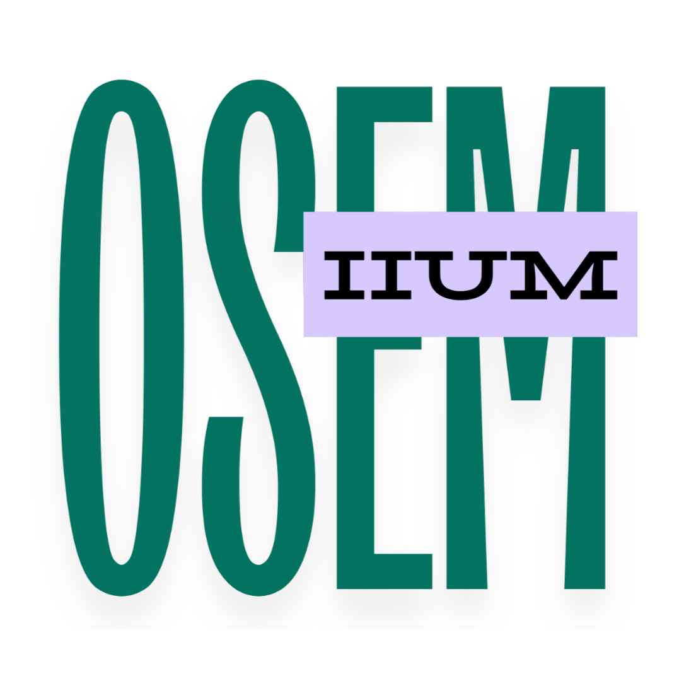

<p align="center">
  
</p>

<h1 align="center">OSEM — Online Summon and Enforcement Management</h1>
<p align="center">A centralized web-based enforcement and vehicle management system for IIUM's Office of Security Management.</p>

---


## Table of Contents
- [About](#about)
- [Features](#features)
- [User Roles](#user-roles)
- [Technical Implementation & Structure](#technical-implementation-&-structure)
- [Installation & Setup Instructions](#installation-&-setup-instructions)
- [Future Improvements](#future-improvements)
- [Contributors](#contributors)


---

## About

The **Office of Security Management (OSeM)** at the International Islamic University Malaysia (IIUM) is responsible for maintaining safety and order across campus. Two of its primary duties include managing campus vehicle access through a sticker registration process and enforcing campus regulations by issuing disciplinary compounds.

Currently, the digital infrastructure supporting these operations is highly fragmented. Students and staff must navigate a disjointed web of legacy systems — viewing basic records on the general iMaalum portal, applying for vehicle stickers through an isolated Auxiliary Police System (APS), and managing or appealing campus violations via a separate Compoundable Offence System (ICOS) platform. Furthermore, the enforcement process itself remains fundamentally manual; security officers issue physical compound slips on vehicle windshields during patrols, which must be manually re-typed into the office system hours later.

**OSEM** is a dedicated web-based application proposed to resolve these administrative bottlenecks. It bridges the gap between vehicle registration and disciplinary enforcement, providing a centralized ecosystem where users can seamlessly register vehicles and track compound statuses, while empowering security officers and administrators to manage applications, record violations digitally, and oversee campus enforcement through a single, unified dashboard.

---

## Features

### Authentication & Role-Based Access
All users sign in using their IIUM email and password. Access to pages and actions is controlled by role, ensuring each party only sees what is relevant to them. To simulate IIUM's closed Central Authentication Service (CAS), public registration is disabled — only administrators can manage user accounts.

### Vehicle Registration & Sticker Management
Users register their vehicle by submitting a plate number, vehicle type, and reason for campus access, which serves as the vehicle sticker request. Officers review and approve or reject submissions, while administrators can manage all records.

### Compound Issuance
Officers issue compounds by looking up a plate number, viewing the vehicle's registration status, and selecting the relevant offence. Each compound covers one offence.

### Compound Appeals
Users may appeal a compound by submitting a written reason (one appeal allowed per compound). If approved, the compound amount is halved to simulate a discount; if rejected, the full amount remains payable.

### Payment (Simulated)
For this prototype, IIUM EzPay gateway integration is simulated. Users confirm payment directly within the platform, which automatically updates the compound's status to Paid.

### Admin Dashboard
Displays the number of compounds issued, count of unresolved applications and appeals, total payment amount received, and officer activity.

### Offence Type Management
Administrators configure the list of offence types and their preset compound amounts, which officers refer to when issuing compounds.

---

## User Roles

| Role | Access |
|------|--------|
| **Admin** | Full system access — user management, offence configuration, vehicle records, and dashboard. |
| **Officer** | Operational access — reviewing vehicle applications, issuing compounds, and resolving appeals. |
| **User** | Personal access only — registering vehicles, viewing own compounds, and submitting appeals. |

---

## Technical Implementation & Structure

### Technologies Used

|  |  |
|------|--------|
| **Framework** | Laravel 11 |
| **Frontend** | AdminKit (Bootstrap 5) + Blade Templates |
| **Authentication** | Laravel Jetstream + Fortify |
| **Database** | MySQL |

### Project Structure

The project follows Laravel's standard MVC (Model-View-Controller) architecture:
- Controllers are organized into dedicated subfolders (Admin/, Officer/, User/) to cleanly separate business logic based on user roles.
- Views are grouped inside resources/views/ under role-specific directories (admin/, officer/, user/), with all pages extending a core master/layout.blade.php template.

### Database Design & ERD

The relational database utilizes five primary tables to handle the core logic:  
| Table | Description |
|------|-------------|
| users | Stores user authentication data including ID, name, email, password, matric/staff number, role, and active status. |
| vehicles | Linked via a foreign key to the user; stores plate number, vehicle type, reason for registration, and approval status. |
| offence_types | A configuration table storing the offence ID, name, and preset decimal amount. |
| compounds | The central transactional table. It links the vehicle, officer, and offence type via foreign keys, tracking the compound status, discount boolean flag, and timestamps for issuance and payment. |
| appeals | Linked to a specific compound ID and the reviewing officer ID, recording the written reason, the review result, and submission date. |

---

## Installation & Setup Instructions

### System Requirements

- PHP 8.2 or higher
- Composer
- Node.js & NPM
- MySQL Database Environment (e.g., XAMPP, Laragon, or Laravel Herd)
- Git

### Step-by-Step Installation

1. **Clone the Repository:**
```bash
   git clone https://github.com/asywrq/OSEM_OSeM.git
   cd osem
   ```

2. **Install PHP Dependencies:**
```bash
   composer install
   ```

3. **Environment Setup:**
   Duplicate the `.env.example` file, rename it to `.env`, and update your `DB_DATABASE`, `DB_USERNAME`, and `DB_PASSWORD` variables to match your local MySQL setup.
```bash
   cp .env.example .env
   php artisan key:generate
   ```

4. **Database Migration & Seeding:**
   Run this command to build the tables and inject dummy data (users, vehicles, offence types) into the database.
```bash
   php artisan migrate --seed
   ```

5. **Install Frontend Dependencies:**
```bash
   npm install
   npm run build
   ```

6. **Serve the Application:**
```bash
   php artisan serve
   ```
   *The application will now be accessible at `http://127.0.0.1:8000`.*

---

## Future Improvements

To scale OSEM into a fully integrated campus solution, the following long-term objectives are planned:
- **System Integration:** Full API integration with iMaalum and IIUM's CAS portal for seamless login and unified campus data sharing.
- **Mobile Enforcement:** Mobile-responsive interfaces allowing officers to issue compounds in real-time via smartphones during patrols.
- **AI Automation:** AI-driven license plate recognition via patrol cameras to automatically detect and log parking violations.
- **Office Management:** Expand the platform to track staff schedules, manage guest vehicle entries, and generate data-driven income insights.

---

## Contributors

| Name | Role |
|------|------|
| **Anwar Syafiq** | Project Lead |
| **Danish Rahmat** | Developer |
| **Danish Aiman** | Developer |
| **Aizat Adnan** | Developer |
| **Fadli Baharuddin** | Developer |

---

<p align="center">
  Developed for BIIT 2305 — Web Application Development<br>
  International Islamic University Malaysia (IIUM)
</p>
